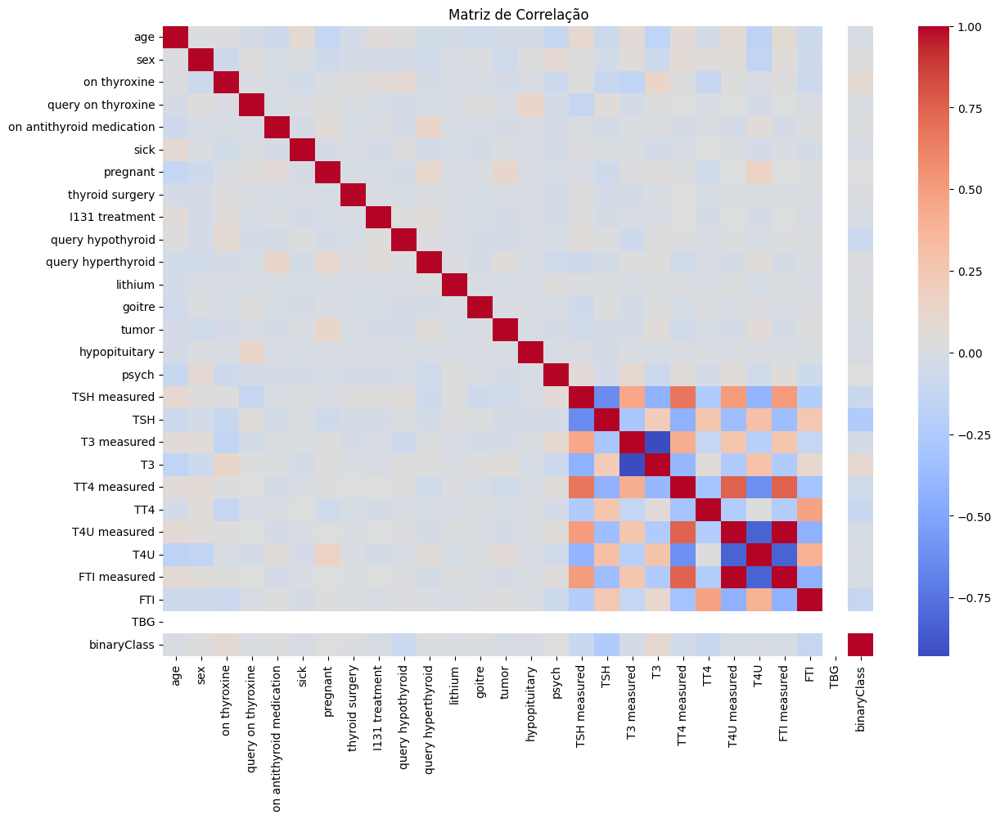
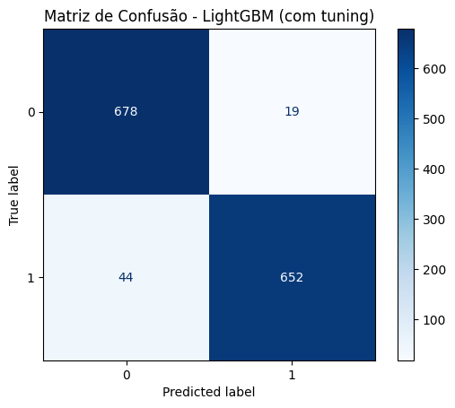
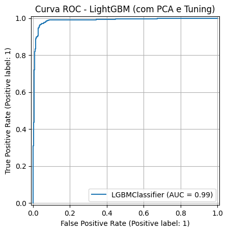

# 🧠 Modelagem Preditiva para Diagnóstico de Hipotireoidismo

Este projeto tem como objetivo desenvolver um modelo de machine learning para **classificação de pacientes com distúrbios da tireoide**, a partir de variáveis clínicas e laboratoriais. Através de um pipeline completo, desde a limpeza dos dados até a avaliação do modelo.

---

## 📂 Estrutura do Projeto

- `ProjetoFinal_HT.ipynb`: Notebook com todo o pipeline do projeto
- `img/`: Pasta com imagens e visualizações geradas durante a análise
- `README.md`: Documentação do projeto
- `LICENSE`: Licença MIT de uso

---

## 🧾 Base de Dados

A base de dados utilizada neste projeto foi originalmente disponibilizada como parte das atividades do curso de Ciência de Dados da **EBAC**.

Para facilitar o acesso, fiz o upload da base para o Google Drive:

📥 [Clique aqui para baixar o dataset (CSV)](https://drive.google.com/file/d/1hzzvJzxmFSqlERj0opHbH63vKtCUXOPb/view?usp=sharing)

Ela contém informações clínicas e laboratoriais de pacientes, incluindo:
- Histórico de tratamento ou cirurgias
- Presença de sintomas ou condições específicas
- Medidas hormonais como T3, TSH, TT4, FTI e T4U

A variável alvo `binaryClass` indica se o paciente possui ou não uma condição tireoidiana.

---

## 📖 Dicionário de Dados

| **Variável**                 | **Descrição**                                                                 | **Tipo**             | **Valores Possíveis / Observações**                                   |
|-----------------------------|------------------------------------------------------------------------------|----------------------|------------------------------------------------------------------------|
| `age`                       | Idade do paciente                                                            | Numérica contínua    | Ex: 35                                                                  |
| `sex`                       | Sexo do paciente                                                             | Categórica            | `M` (masculino), `F` (feminino)                                        |
| `on_thyroxine`              | Uso de tiroxina                                                              | Binária              | `t` (sim), `f` (não)                                                   |
| `query_on_thyroxine`        | Suspeita de uso de tiroxina                                                  | Binária              | `t`, `f`                                                               |
| `on_antithyroid_medication` | Uso de medicação antitireoidiana                                             | Binária              | `t`, `f`                                                               |
| `sick`                      | Se o paciente está doente no momento                                         | Binária              | `t`, `f`                                                               |
| `pregnant`                  | Se o paciente está grávida                                                   | Binária              | `t`, `f`                                                               |
| `thyroid_surgery`           | Histórico de cirurgia na tireoide                                           | Binária              | `t`, `f`                                                               |
| `I131_treatment`            | Tratamento com iodo radioativo                                               | Binária              | `t`, `f`                                                               |
| `query_hypothyroid`         | Suspeita de hipotireoidismo                                                  | Binária              | `t`, `f`                                                               |
| `query_hyperthyroid`        | Suspeita de hipertireoidismo                                                 | Binária              | `t`, `f`                                                               |
| `lithium`                   | Uso de lítio                                                                 | Binária              | `t`, `f`                                                               |
| `goitre`                    | Presença de bócio                                                            | Binária              | `t`, `f`                                                               |
| `tumor`                     | Presença de tumor                                                            | Binária              | `t`, `f`                                                               |
| `hypopituitary`             | Diagnóstico de hipopituitarismo                                              | Binária              | `t`, `f`                                                               |
| `psych`                     | Condição psiquiátrica relevante                                              | Binária              | `t`, `f`                                                               |
| `TSH`                       | Hormônio estimulador da tireoide                                             | Numérica contínua    | Ex: 1.3 (μU/mL)                                                        |
| `T3`                        | Triiodotironina total                                                        | Numérica contínua    | Ex: 2.8 (ng/dL)                                                        |
| `TT4`                       | Tiroxina total                                                               | Numérica contínua    | Ex: 120 (μg/dL)                                                        |
| `T4U`                       | Captação de tiroxina livre                                                   | Numérica contínua    | Índice relativo                                                        |
| `FTI`                       | Índice de tiroxina livre (Free Thyroxine Index)                              | Numérica contínua    | Índice relativo                                                        |
| `TBG`                       | Globulina ligadora de tiroxina                                               | Constante / Excluída | Valor constante — removida da modelagem                               |
| `binaryClass`               | Variável alvo (condição tireoidiana ou não)                                  | Binária              | `0` (saudável), `1` (com condição)                                     |

---

## 📊 Análise Exploratória

A análise inicial revelou:

- Presença de variáveis com valores nulos ou constantes
- Colunas binárias com distribuição altamente concentrada
- Destaque para variáveis laboratoriais como TSH, T3 e FTI, que apresentaram maior poder discriminativo

---

## ⚙️ Pipeline de Modelagem

As etapas incluíram:

1. **Pré-processamento**:
   - Remoção de colunas com valor constante ou alta redundância
   - Codificação de variáveis categóricas com `LabelEncoder`
2. **Balanceamento**:
   - Aplicação de SMOTE para lidar com desbalanceamento da variável alvo
3. **Redução de Dimensionalidade**:
   - Utilização de PCA para preservar variância e reduzir ruído
4. **Modelagem**:
   - Treinamento com LightGBM
   - Tuning de hiperparâmetros
5. **Validação**:
   - Avaliação com matriz de confusão, F1-score, AUC e curva ROC

---

## 📈 Resultados

- **Acurácia**: 95%
- **F1-Score**: 0.95 (ambas as classes)
- **AUC**: 0.9878

O modelo demonstrou excelente desempenho, com equilíbrio entre precisão e sensibilidade. O uso de técnicas como SMOTE e PCA contribuiu para uma performance robusta, mesmo com um dataset originalmente desbalanceado e ruidoso.

---
## ✅ Conclusões e Aprendizados

O desenvolvimento deste projeto proporcionou uma compreensão prática e aprofundada sobre como técnicas de ciência de dados podem ser aplicadas em problemas reais da área da saúde. A construção de um pipeline completo, desde a análise exploratória até a avaliação final do modelo, reforçou a importância de cada etapa no desempenho da solução final.

### 🔍 Principais conclusões:
- As variáveis laboratoriais foram as mais relevantes para a predição de distúrbios da tireoide, confirmando o papel central dos exames hormonais nesse diagnóstico.
- O uso de SMOTE foi essencial para lidar com o desbalanceamento da base, garantindo que o modelo aprendesse padrões das duas classes de forma equilibrada.
- Mesmo com a aplicação de PCA, o modelo manteve excelente desempenho, demonstrando que é possível reduzir a dimensionalidade sem perder acurácia, quando feito de forma adequada.

### 💡 Aprendizados pessoais:
- A importância de entender o domínio do problema antes de modelar. O contexto clínico foi essencial para guiar decisões como eliminação de variáveis irrelevantes e interpretação dos resultados.
- A combinação entre balanceamento, redução de dimensionalidade e tuning de hiperparâmetros tem um impacto direto no desempenho do modelo.
- O LightGBM mostrou-se uma ferramenta poderosa, rápida e eficaz, especialmente em problemas com muitas variáveis e classes desbalanceadas.

Este projeto reafirma o potencial do aprendizado de máquina como suporte à medicina diagnóstica e destaca a importância de pipelines bem estruturados para alcançar soluções realmente eficientes.

---

## 🔓 Licença

Este projeto está licenciado sob os termos da [Licença MIT](LICENSE).

---

## 💡 Autor

Desenvolvido por **Lucas Sugahara Lima**.

Conecte-se comigo no [LinkedIn](https://www.linkedin.com/in/lucas-sugahara/) 💙
