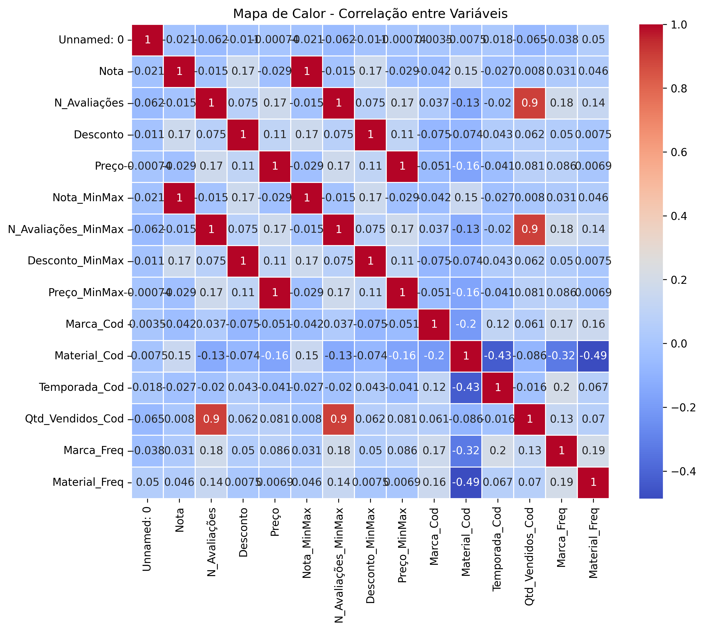
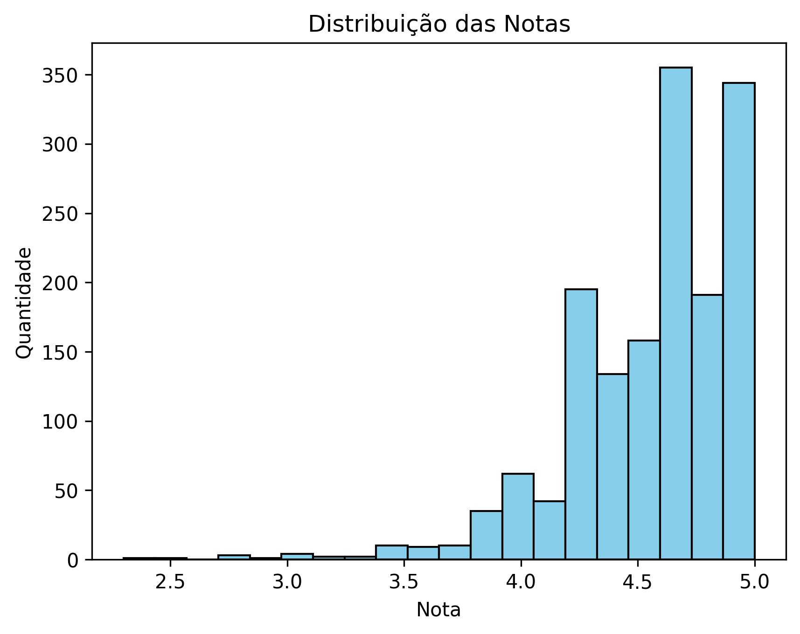
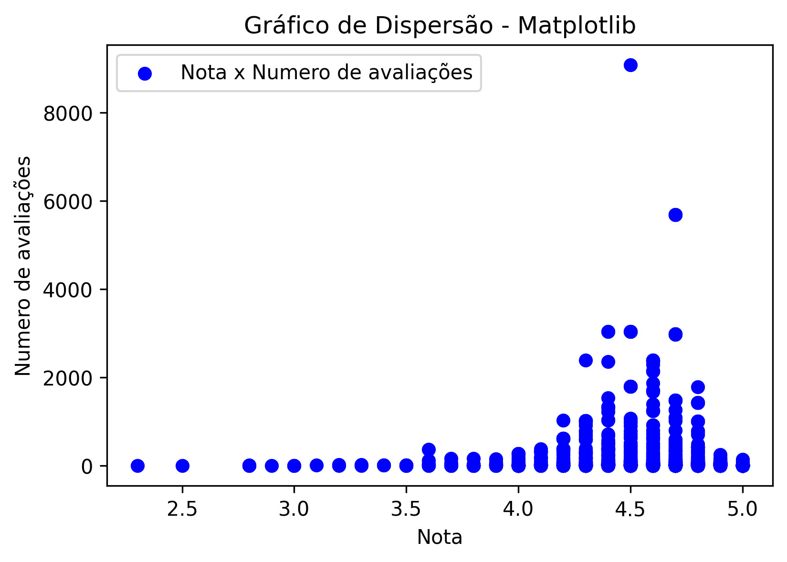
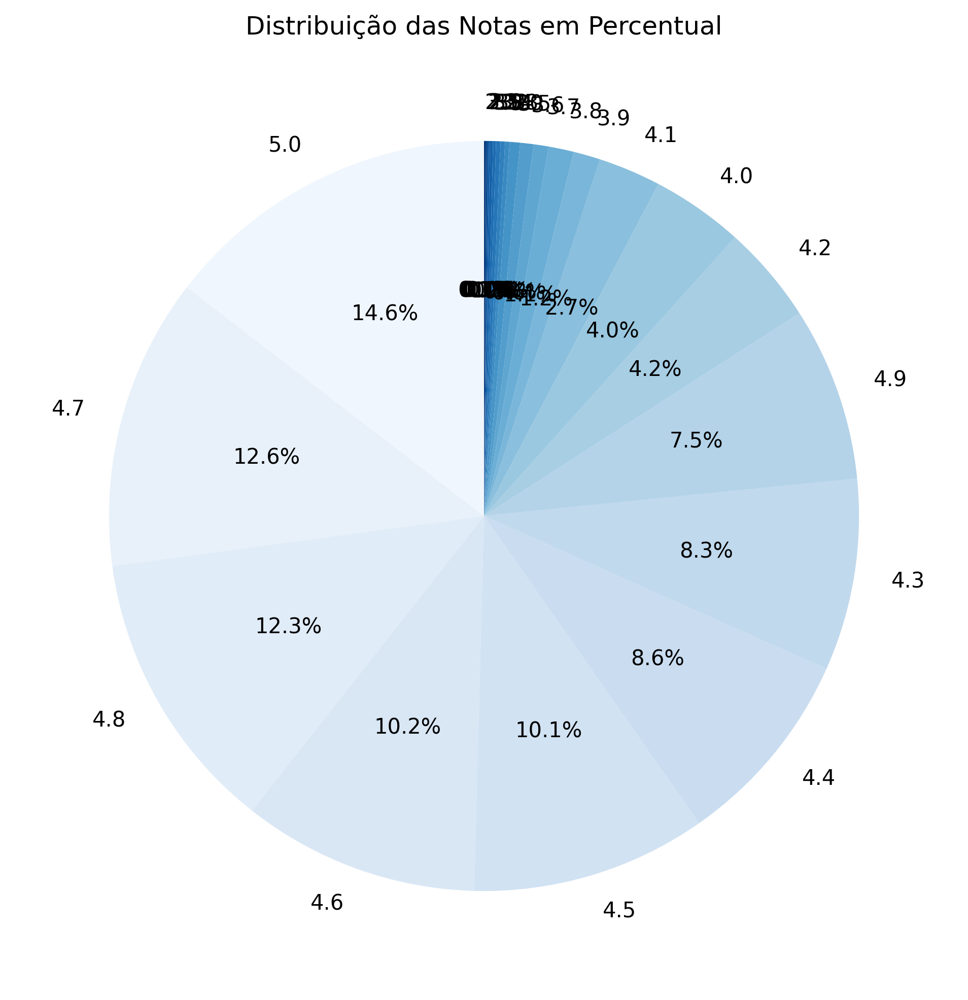
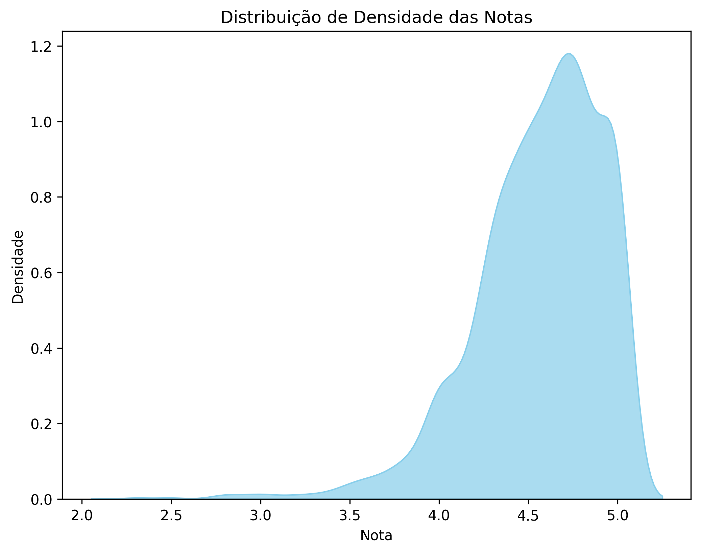
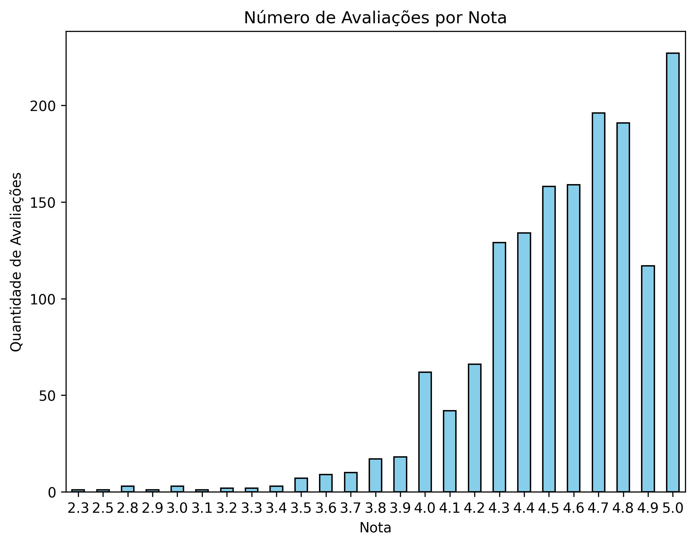
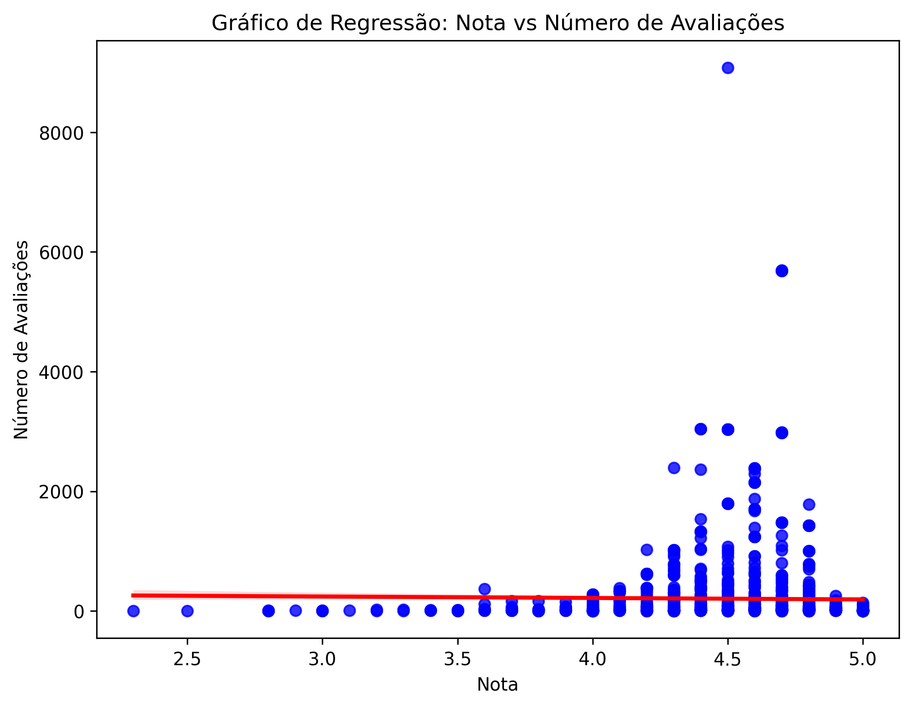

# Análise de Avaliações de Produtos no E-commerce 🌐

Este projeto realiza uma análise exploratória dos dados de avaliações de produtos em uma plataforma de e-commerce. Foram gerados diversos gráficos estatísticos para compreender o comportamento dos usuários em relação às notas atribuídas aos produtos.

---

## 📈 Objetivo

Investigar como os usuários avaliam os produtos, identificar padrões entre a nota e o número de avaliações, e compreender a distribuição dessas informações por meio de gráficos.

---

## 📊 Dicionário de Dados

| Coluna                | Descrição                                           |
|-----------------------|-----------------------------------------------------|
| `Nota`                | Nota média dada ao produto                          |
| `N_Avaliações`         | Número total de avaliações recebidas              |
| `Desconto`            | Percentual de desconto aplicado no produto         |
| `Preço`               | Preço original do produto                          |
| `Nota_MinMax`         | Nota normalizada entre 0 e 1                       |
| `N_Avaliações_MinMax` | Número de avaliações normalizado                |
| `Desconto_MinMax`     | Desconto normalizado                              |
| `Preço_MinMax`        | Preço normalizado                                |
| `Marca_Cod`           | Codificação numérica da marca                    |
| `Material_Cod`        | Codificação numérica do material                 |
| `Temporada_Cod`       | Codificação numérica da temporada                |
| `Qtd_Vendidos_Cod`    | Codificação numérica da quantidade vendida       |
| `Marca_Freq`          | Frequência relativa da marca                      |
| `Material_Freq`       | Frequência relativa do material                   |

---

## 🌐 Análises Gráficas

### 🔹 Mapa de Calor - Correlação entre Variáveis


- A variável `Qtd_Vendidos_Cod` está altamente correlacionada com `N_Avaliações_MinMax` (0.90).
- Variáveis de codificação de marca e material apresentam correlações negativas entre si.

### 🔹 Histograma das Notas


- A maior parte das notas está entre 4.5 e 5.0, o que indica uma tendência de avaliações positivas.

### 🔹 Gráfico de Dispersão


- Produtos com notas altas não necessariamente têm muitas avaliações.
- Alguns poucos produtos acumulam milhares de avaliações.

### 🔹 Gráfico de Pizza - Distribuição das Notas


- Grande concentração de notas em 4.7, 4.8, 4.9 e 5.0.
- Poucas notas abaixo de 4.0.

### 🔹 Gráfico de Densidade


- Distribuição suavizada confirma o comportamento positivo das avaliações.
- Pico de densidade próximo da nota 4.8.

### 🔹 Gráfico de Barras - Avaliações por Nota


- Confirma a distribuição vista no histograma: poucas avaliações abaixo de 4.0.

### 🔹 Gráfico de Regressão - Nota vs. Número de Avaliações


- Correlação visual fraca; a linha de regressão é quase plana.
- Produtos com boas notas não são necessariamente os mais populares.

---

## 🧠 Conclusões

- A maioria dos produtos é bem avaliada, com grande concentração de notas entre 4.5 e 5.0.
- A quantidade de avaliações varia bastante, sem correlação forte com a nota.
- Alguns produtos se destacam com milhares de avaliações, o que pode indicar sucesso comercial.

---

## 📅 Execução do Projeto

1. Clone este repositório:
   ```bash
   git clone https://github.com/seu_usuario/seu_repositorio.git
   ```

2. Instale as dependências:
   ```bash
   pip install -r requirements.txt
   ```

3. Execute o notebook:
   - `Profissao_Cientista_de_Dados_M10_Pratique.ipynb`

4. Base de dados utilizada:
   - [Download ecommerce_preparados.csv (Google Drive)](https://drive.google.com/file/d/1FUfMcQGFsknPufeQcHeNyj2lBfuQUCg9/view?usp=sharing)

---

## 🛠️ Tecnologias Utilizadas

- Python
- pandas
- matplotlib, seaborn
- Jupyter Notebook

---

## ✨ Autor

Projeto desenvolvido por [Sugaharaa](https://github.com/Sugaharaa)

