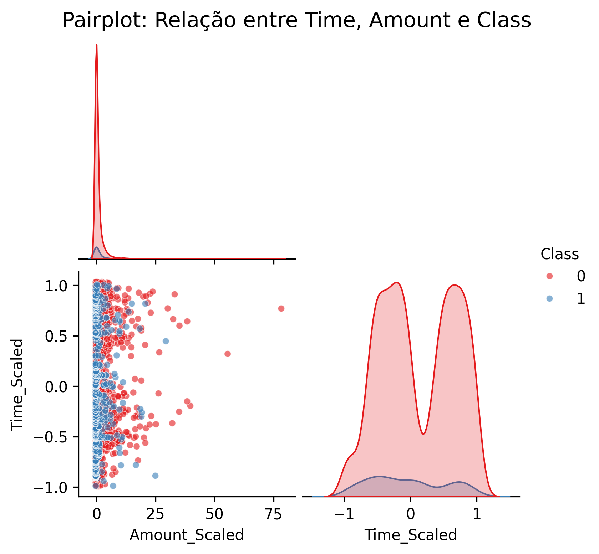
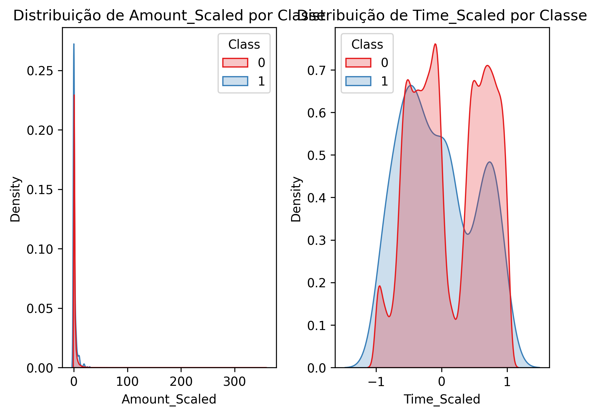
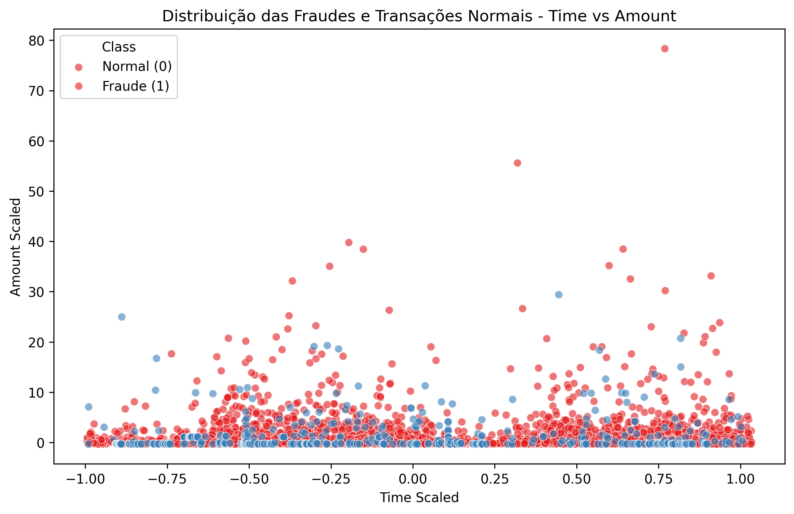
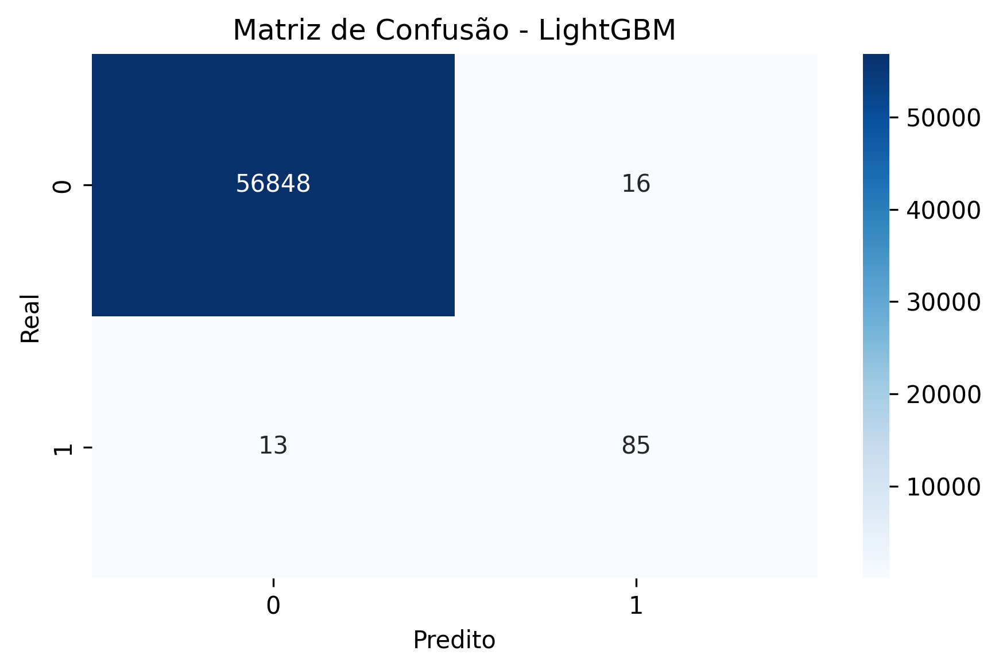
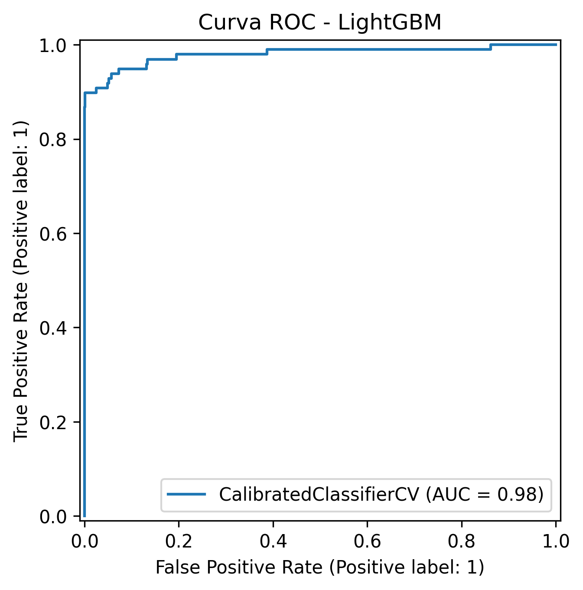

# 🕵️ Detecção de Fraudes em Transações Financeiras

Este projeto tem como objetivo desenvolver um modelo de machine learning para **detecção de fraudes** em transações financeiras, utilizando técnicas de pré-processamento, balanceamento de classes, validação cruzada, tuning de hiperparâmetros e calibração de probabilidades.

---

## 📁 Estrutura do Projeto

- `Projeto_Final_fraud_detection.ipynb`: Notebook completo com todos os passos do projeto  
- `README.md`: Documentação do projeto  
- `img/`: Pasta com visualizações salvas (gráficos gerados durante a análise)  

---

## 🧾 Coleta de Dados

Os dados utilizados neste projeto foram fornecidos na página da atividade do curso, mas foram hospedados manualmente no Google Drive para facilitar o acesso. A base representa transações financeiras de cartões de crédito, com classificações de transações legítimas e fraudulentas.

- 📁 **Fonte**: Arquivo CSV hospedado no [Google Drive](https://drive.google.com/file/d/1xkM3LcbbQOfu3T_3U41siVD_f5JBWJc_/view?usp=drive_link)  
- 📌 **Nome esperado**: `Base_M43_Pratique_CREDIT_CARD_FRAUD.csv`  
- 💾 **Formato**: `.csv` com colunas numéricas transformadas via PCA

```python
import pandas as pd
df = pd.read_csv("Base_M43_Pratique_CREDIT_CARD_FRAUD.csv")

```

---

## 📘 Dicionário de Dados

| Coluna          | Descrição                                                                 |
|------------------|---------------------------------------------------------------------------|
| `Time`           | Tempo decorrido desde a primeira transação registrada                     |
| `V1` a `V28`     | Variáveis numéricas anônimas extraídas via PCA                            |
| `Amount`         | Valor da transação em dinheiro                                            |
| `Class`          | Rótulo da transação (`0` = legítima, `1` = fraude)                        |
| `Amount_Scaled`  | Valor da transação padronizado                                            |
| `Time_Scaled`    | Tempo da transação padronizado                                            |

> 🔎 As variáveis `V1` a `V28` são componentes principais extraídas para proteger a confidencialidade dos dados originais.

---

## 🚀 Tecnologias e Bibliotecas Utilizadas

- Python 3
- Pandas, NumPy  
- Scikit-learn  
- LightGBM, XGBoost, RandomForest  
- Imbalanced-learn (SMOTE)  
- Matplotlib, Seaborn  
- CalibratedClassifierCV  
- RandomizedSearchCV
- Google Colab

---

## 🔄 Pipeline de Modelagem

1. Leitura e análise exploratória  
2. Criação de variáveis escaladas: `Amount_Scaled`, `Time_Scaled`  
3. Balanceamento com SMOTE  
4. Treinamento com RandomForest, XGBoost e LightGBM  
5. Tuning com RandomizedSearchCV  
6. Validação cruzada com 3 folds   
7. Avaliação com métricas como F1-score, AUC, Matriz de Confusão e Curva ROC


---

## 📈 Resultados

| Modelo       | F1-score médio |
|--------------|----------------|
| **LightGBM** | **0.9991**     |
| XGBoost      | 0.9989         |
| RandomForest | 0.9959         |

- O **LightGBM** obteve o melhor desempenho com ótimo tempo de execução (~13 minutos).  
- O **XGBoost** apresentou desempenho semelhante, porém com execução muito mais demorada (~1h30min).  

---

## 📊 Exemplos de Visualizações

- **Pairplot:**  
  

- **Distribuição KDE:**  
  

- **Scatterplot Time vs Amount:**  
  

- **Matriz de Confusão:**  
  

- **Curva ROC:**  
  

---

## 📌 Conclusões e Aprendizados

O modelo baseado em LightGBM foi altamente eficaz para detectar fraudes com um F1-score de 0.9991 e excelente curva ROC.
A estrutura do pipeline e as técnicas de pré-processamento aplicadas se mostraram cruciais para alcançar esse resultado.

💡 **Principais aprendizados:**

- O uso de **SMOTE** foi essencial para lidar com o desbalanceamento da base.    
- As **visualizações**, como curva ROC e matriz de confusão, foram úteis para interpretar e justificar a performance dos modelos.
- A validação cruzada garantiu estabilidade dos resultados entre os folds.
- Ferramentas como matriz de confusão e curva ROC foram essenciais para avaliar o modelo de forma crítica.

Este projeto demonstrou como pipelines bem estruturados e validação cuidadosa podem gerar modelos robustos e prontos para aplicações reais.

O modelo baseado em LightGBM foi altamente eficaz para detectar fraudes com um F1-score de 0.9991 e excelente curva ROC.
A estrutura do pipeline e as técnicas de pré-processamento aplicadas se mostraram cruciais para alcançar esse resultado.


---

## 👨‍💼 Autor

**Lucas Sugahara**  
📧 [lucassugahara.trabalho@gmail.com](mailto:lucassugahara.trabalho@gmail.com)  
💼 [LinkedIn](https://www.linkedin.com/in/lucas-sugahara)

---

## 🛠️ Como rodar este projeto

1. Clone o repositório:

```bash
git clone https://github.com/Sugaharaa/fraud-detection.git
```

2. Instale as dependências:

```bash
pip install pandas numpy scikit-learn lightgbm xgboost imbalanced-learn matplotlib seaborn
```

3. Coloque o arquivo `.csv` baixado na mesma pasta do notebook.

4. Execute o notebook `Projeto_Final.ipynb` no Jupyter ou Colab.

---

⭐ Se este projeto te ajudou ou inspirou, deixe uma estrela no repositório!
